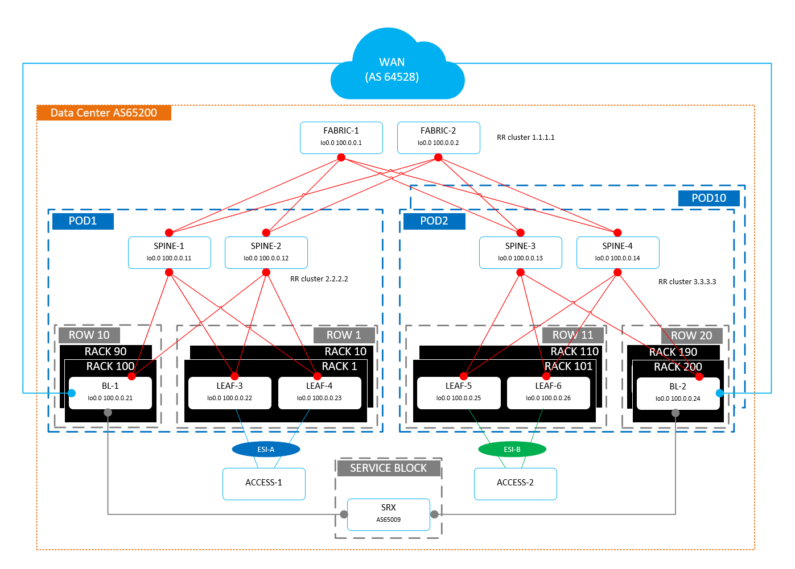

# Routing at Leaf Layer
This exercise presents a demonstration of a data center network infrastructure running EVPN/VXLAN with routing at the leaf layer. The design approach has been taken from the book THIS WEEK: DATA CENTER
DEPLOYMENT WITH EVPN/VXLAN By Deepti Chandra discussed in the Chapter 2 Building a Data Center – Routing at the Leaf Layer.

## Description
Some small deviations from the original setup presented in the book have been made here, for instance the hosts have been substituted by another QFX switch ACCESS-1 and ACCESS-2 which have been configured with multiple routing instance to be able to perform connectivity tests.

## Network Diagram
.

## Connectivity tests
Several tests can be performed when the network simulation is fully operational. In particular, intra-VRF L2 and L3 connectivity, inter-VRF connectivity with service insertion and north-south connectivity with service insertion.
All these test can be performed by following the templates stored in the folder [tests](tests).

## Access
All devices are accessible through telnet session towards a host running eve-ng established on a specific TCP port referring to a respective network device. There's a mRemote access profile [mRemote_profile.xml](mRemote_profile.xml) stored in the repository to ease access to devices.
The root account is configured with the password Juniper123.

## Requirements
As this lab consists of many virtual devices it requires either a physical server or a virtual machine with a lot of CPU and RAM resources. More info can be found in the folder requirements. 

## EVE-NG Images & software releases

| Device   | Type | Software |
|---| --- | --- |
| ACCESS-x | VQFX10K | vqfxpfe-10K-F-18.4R1.8 & vqfxpfe-10K-F-18.4R1.8 & |
| BL-x | VQFX10K | vqfxpfe-10K-F-18.4R1.8 & vqfxpfe-10K-F-18.4R1.8 & |
| LEAF-x | VQFX10K | vqfxpfe-10K-F-18.4R1.8 & vqfxpfe-10K-F-18.4R1.8 & |
| SPINE-x | VQFX10K | vqfxpfe-10K-F-18.4R1.8 & vqfxpfe-10K-F-18.4R1.8 & |
| FABRIC-x | VQFX10K | vqfxpfe-10K-F-18.4R1.8 & vqfxpfe-10K-F-18.4R1.8 & |
| PE-x  | vSRXng | vsrxng-19.2R1.8 (packet mode) |
| SRX-SB | vSRXng | vsrxng-19.2R1.8 |

